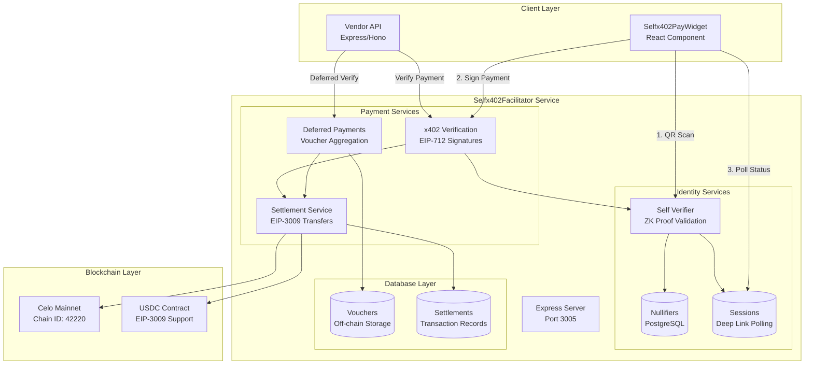
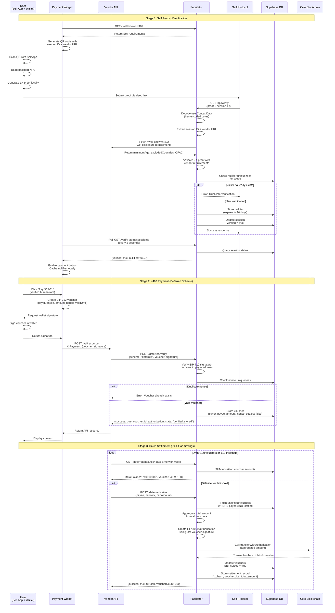
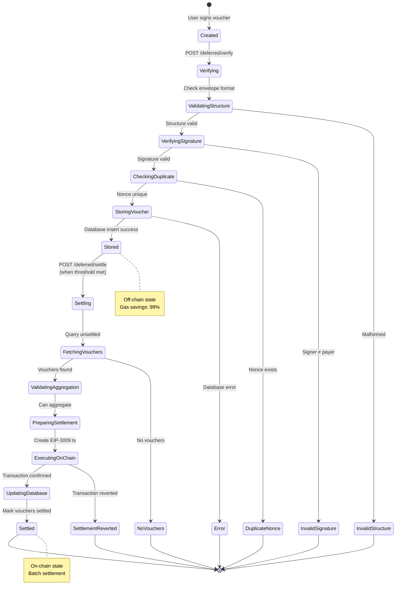
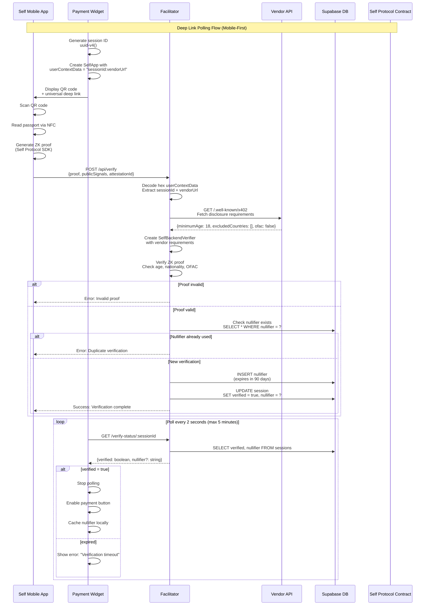

# Selfx402 Facilitator

[](https://opensource.org/licenses/MIT)
[](https://www.typescriptlang.org/)
[](https://celo.org/)
[](https://facilitator.selfx402.xyz/)

A production-ready facilitator service for the x402 payment protocol with **Self Protocol integration** enabling proof-of-unique-human verification and tiered pricing on Celo blockchain.

**🌐 Live Production Endpoint**: [https://facilitator.selfx402.xyz/](https://facilitator.selfx402.xyz/)

## 🚀 Overview

**Selfx402Facilitator** is a centralized payment verification and settlement service that combines:
- **x402 Protocol**: HTTP-native crypto micropayments with EIP-712 signatures
- **Self Protocol**: Zero-knowledge passport verification for proof-of-unique-human
- **Tiered Pricing**: Verified humans pay 1000x less than bots ($0.001 vs $1.00)
- **Deferred Payments**: Off-chain voucher aggregation for 99% gas savings (x402 PR #426)
- **Celo Network**: Mobile-first blockchain with fast finality and low fees

### 🎯 Key Features

- ✅ **x402 Standard Compliance** - Full implementation of x402 payment protocol
- ✅ **Deferred Payment Scheme** - x402 PR #426 Option A with voucher aggregation
- ✅ **Self Protocol Integration** - Zero-knowledge proof validation with nullifier tracking
- ✅ **EIP-3009 Settlements** - Gasless USDC transfers via `transferWithAuthorization`
- ✅ **Deep Link Polling** - Mobile-first verification with session-based status checking
- ✅ **Supabase Database** - PostgreSQL storage for nullifiers, vouchers, and sessions
- ✅ **Production Ready** - Deployed on Celo mainnet with comprehensive error handling

## 📊 Architecture

### System Architecture



### Complete Payment Flow Sequence



### Deferred Payment Voucher Lifecycle



### Self Protocol Verification Flow



## 🛠️ Quick Start

### Prerequisites

- **Node.js**: v18 or higher
- **Celo Wallet**: Private key with CELO for gas fees
- **Supabase Account**: For PostgreSQL database (optional, falls back to in-memory)
- **ngrok Account**: For public HTTPS endpoint (required for Self Protocol)

### 1. Clone and Install

```bash
# Clone the repository
git clone https://github.com/zkNexus/Selfx402Facilitator.git
cd Selfx402Facilitator

# Install dependencies
npm install
```

### 2. Setup Supabase Database

**Create Supabase Project:**
1. Go to [https://app.supabase.com](https://app.supabase.com)
2. Click **New Project**
3. Choose project name, database password, and region
4. Wait ~2 minutes for initialization

**Run Database Schema:**
1. Open **SQL Editor** in Supabase dashboard
2. Copy entire contents of [database/schema.sql](database/schema.sql)
3. Paste and click **Run**
4. Verify tables created: `nullifiers`, `vouchers`, `settlements`, `verification_sessions`

**Get API Credentials:**
1. Go to **Project Settings** → **API**
2. Copy **Project URL** (e.g., `https://xyz.supabase.co`)
3. Copy **service_role** key (secret key, keep secure!)

### 3. Configure Environment

```bash
# Copy example environment file
cp .env.example .env

# Edit .env with your configuration
nano .env
```

**Required Configuration:**

```bash
# Server Configuration
PORT=3005
NODE_ENV=development

# Self Protocol (use ngrok domain, see step 4)
SERVER_DOMAIN=https://your-domain.ngrok.io
SELF_ENDPOINT=https://your-domain.ngrok.io/api/verify
SELF_SCOPE=self-x402-facilitator

# Celo Mainnet (REQUIRED)
CELO_MAINNET_PRIVATE_KEY=0xYOUR_PRIVATE_KEY_HERE
CELO_MAINNET_RPC_URL=https://forno.celo.org

# Supabase Database
SUPABASE_URL=https://your-project.supabase.co
SUPABASE_SERVICE_ROLE_KEY=your-service-role-key-here

# Network Configuration
DEFAULT_NETWORK=celo
CELO_MAINNET_USDC=0xcebA9300f2b948710d2653dD7B07f33A8B32118C
```

⚠️ **Security Warnings:**
- **NEVER** commit `.env` file to git (already in `.gitignore`)
- Keep `CELO_MAINNET_PRIVATE_KEY` secret (controls wallet funds)
- Keep `SUPABASE_SERVICE_ROLE_KEY` secret (full database access)
- Use production wallet with minimal CELO for gas only

### 4. Setup ngrok Tunnel

Self Protocol requires a **publicly accessible HTTPS endpoint** for verification callbacks.

**Using ngrok:**

```bash
# Make start script executable
chmod +x start-ngrok.sh

# Start ngrok tunnel (uses domain from .env if configured)
./start-ngrok.sh
```

**Or manually:**

```bash
# If you have a reserved ngrok domain
ngrok http --domain=your-domain.ngrok.io 3005

# Or without reserved domain (gets random URL)
ngrok http 3005
```

**Update .env with ngrok URL:**

```bash
# Copy the HTTPS URL from ngrok output
SERVER_DOMAIN=https://abc123.ngrok.io
SELF_ENDPOINT=https://abc123.ngrok.io/api/verify
```

💡 **ngrok Tips:**
- Free tier gives random URLs that change on restart
- Paid tier ($8/month) allows reserved domains for consistency
- Alternative: Use Railway/Render deployment for permanent HTTPS

### 5. Build and Run

**Development mode** (with hot reload):

```bash
npm run dev
```

**Production mode:**

```bash
# Build TypeScript
npm run build

# Start server
npm start
```

**Expected console output:**

```
🚀 Celo x402 Facilitator started on port 3005
📡 Network: Celo Mainnet (Chain ID: 42220)
💰 USDC Contract: 0xcebA9300f2b948710d2653dD7B07f33A8B32118C
🌐 Public endpoint: https://your-domain.ngrok.io
✅ Supabase database service initialized
✅ Database connection successful
✅ SelfVerificationService initialized with Supabase database
```

### 6. Verify Installation

**Health check:**

```bash
curl http://localhost:3005/health
```

**Expected response:**

```json
{
  "status": "healthy",
  "timestamp": "2025-01-15T12:00:00.000Z",
  "network": {
    "name": "Celo Mainnet",
    "chainId": 42220,
    "usdc": "0xcebA9300f2b948710d2653dD7B07f33A8B32118C",
    "rpcUrl": "https://forno.celo.org",
    "explorer": "https://celoscan.io"
  }
}
```

**Check supported payment schemes:**

```bash
curl http://localhost:3005/supported
```

**Expected response:**

```json
{
  "x402Version": 1,
  "kind": [
    {
      "scheme": "exact",
      "networkId": "celo",
      "extra": { "name": "USDC", "version": "2" }
    },
    {
      "scheme": "deferred",
      "networkId": "celo",
      "extra": {
        "name": "USDC",
        "version": "2",
        "description": "x402 PR #426 - Deferred payment with voucher aggregation",
        "minSettlementAmount": "10000000",
        "minVoucherCount": 5
      }
    }
  ]
}
```

## 📖 Usage Guide

### Integration with Vendor APIs

**Step 1: Install NPM Framework Package**

```bash
npm install selfx402-framework
```

**Step 2: Configure Facilitator in Vendor API**

```typescript
// src/config/x402.ts
export const x402Config = {
  network: "celo" as const,
  facilitatorUrl: process.env.FACILITATOR_URL || "https://facilitator.selfx402.xyz",
  paymentPrice: "0.001", // $0.001 USDC for verified humans
  walletAddress: process.env.PAYMENT_WALLET_ADDRESS!,
};
```

**Step 3: Add Service Discovery Endpoint**

```typescript
// src/server.ts
import { x402Config } from "./config/x402";

app.get("/.well-known/x402", (req, res) => {
  res.json({
    version: 1,
    facilitatorUrl: x402Config.facilitatorUrl,
    payment: {
      network: x402Config.network,
      asset: "0xcebA9300f2b948710d2653dD7B07f33A8B32118C", // USDC
      payTo: x402Config.walletAddress,
    },
    verification: {
      enabled: true,
      requirements: {
        minimumAge: 18,
        excludedCountries: [], // ISO 3166-1 alpha-3 codes
        ofac: false,
      },
      scope: "my-api-v1", // Unique identifier for your API
    },
    pricing: {
      tiers: {
        unverified: { price: "1.00", description: "Bot pricing" },
        verified_human: { price: "0.001", description: "1000x cheaper for humans" },
      },
    },
  });
});
```

**Step 4: Add Payment Middleware**

```typescript
// src/middleware/payment-middleware.ts
import { celoPaymentMiddleware } from "selfx402-framework/middleware";
import { x402Config } from "../config/x402";

export const paymentMiddleware = celoPaymentMiddleware({
  facilitatorUrl: x402Config.facilitatorUrl,
  network: x402Config.network,
  paymentPrice: x402Config.paymentPrice,
  walletAddress: x402Config.walletAddress,
  enableSelfProtocol: true,
});

// Apply to protected routes
app.get("/api/protected", paymentMiddleware, (req, res) => {
  const tier = (req as any).tier; // "verified_human" | "unverified"
  const settlementData = (req as any).settlementData;

  res.json({
    message: "Access granted!",
    tier,
    savings: tier === "verified_human" ? "1000x cheaper" : "Standard rate",
  });
});
```

### Integration with Payment Widget

**Step 1: Install Widget Package**

```bash
npm install selfx402-pay-widget
```

**Step 2: Configure Widget**

```typescript
// app/page.tsx
import { PaymentForm } from "selfx402-pay-widget";

export default function Home() {
  return (
    <PaymentForm
      facilitatorUrl="https://facilitator.selfx402.xyz"
      vendorApiUrl="https://api.example.com"
      onSuccess={(result) => {
        console.log("Payment successful!", result);
      }}
      onError={(error) => {
        console.error("Payment failed:", error);
      }}
    />
  );
}
```

**Widget automatically handles:**
- ✅ Self Protocol QR code generation
- ✅ Deep link verification with status polling
- ✅ Deferred payment voucher creation and signing
- ✅ Error handling and retry logic
- ✅ Mobile-optimized responsive UI

### Testing Payment Flow

**Test Deferred Payment (Off-Chain Voucher)**

```bash
# 1. Create and sign voucher (in your client app)
# See selfx402-framework documentation for voucher creation

# 2. Verify voucher with facilitator
curl -X POST http://localhost:3005/deferred/verify \
  -H "Content-Type: application/json" \
  -d '{
    "scheme": "deferred",
    "network": "celo",
    "voucher": {
      "payer": "0xPayer...",
      "payee": "0xPayee...",
      "amount": "1000",
      "nonce": "0x1234...",
      "validUntil": 1735689600
    },
    "signature": "0xabc..."
  }'

# Expected response:
# {
#   "success": true,
#   "verified": true,
#   "voucher_id": "550e8400-e29b-41d4-a716-446655440000",
#   "signer": "0xPayer...",
#   "authorization_state": "verified_stored"
# }

# 3. Check accumulated balance
curl "http://localhost:3005/deferred/balance/0xPayee...?network=celo"

# Expected response:
# {
#   "success": true,
#   "totalBalance": "150000000",
#   "balancesByPayer": [...]
# }

# 4. Settle when threshold met
curl -X POST http://localhost:3005/deferred/settle \
  -H "Content-Type: application/json" \
  -d '{
    "payee": "0xPayee...",
    "network": "celo",
    "minAmount": "10000000"
  }'

# Expected response:
# {
#   "success": true,
#   "txHash": "0xabc...",
#   "voucherCount": 100,
#   "totalAmount": "150000000",
#   "explorer": "https://celoscan.io/tx/0xabc..."
# }
```

**Test Self Protocol Verification**

```bash
# 1. Verify Self proof only (no payment)
curl -X POST http://localhost:3005/verify-self \
  -H "Content-Type: application/json" \
  -d '{
    "proof": "base64-encoded-proof",
    "requirements": {
      "minimumAge": 18,
      "excludedCountries": ["IRN", "PRK"],
      "ofac": false,
      "scope": "test-api-v1"
    },
    "attestationId": "attestation-id-from-self-app",
    "userContextData": {}
  }'

# Expected response:
# {
#   "valid": true,
#   "tier": "verified_human",
#   "nullifier": "0x1234...",
#   "disclosedData": {
#     "ageValid": true,
#     "nationality": "USA",
#     "ofacValid": true
#   }
# }

# 2. Check verification status (deep link polling)
curl "http://localhost:3005/verify-status/session-id-here"

# Expected response:
# {
#   "verified": true,
#   "pending": false,
#   "nullifier": "0x1234...",
#   "expired": false
# }
```

## 🚀 Deployment

### Railway (Recommended)

Railway is the easiest deployment option for monorepo subdirectories.

**Quick Deploy:**

1. **Sign up**: https://railway.app/dashboard
2. **New Project** → **Deploy from GitHub repo**
3. **Select repository**: `Selfx402Facilitator`
4. **⚠️ CRITICAL**: Set **Root Directory** = `Selfx402Facilitator` in Settings
5. **Add Environment Variables** in Variables tab:
   ```
   CELO_MAINNET_PRIVATE_KEY=0xYOUR_KEY
   SUPABASE_URL=https://your-project.supabase.co
   SUPABASE_SERVICE_ROLE_KEY=your-key
   NODE_ENV=production
   SERVER_DOMAIN=https://your-app.up.railway.app
   SELF_ENDPOINT=https://your-app.up.railway.app/api/verify
   SELF_SCOPE=self-x402-facilitator
   ```
6. **Deploy** (auto-deploy on git push)
7. **Get URL** from Settings → Domains
8. **Test**: `curl https://your-app.up.railway.app/health`

**Features:**
- ✅ Free tier: $5/month credit
- ✅ Automatic HTTPS
- ✅ Auto-deploy on push
- ✅ Subdirectory support
- ✅ Web UI (no CLI)

**Cost**: ~$3-5/month (covered by free tier)

**See [RAILWAY_DEPLOYMENT.md](RAILWAY_DEPLOYMENT.md) for detailed guide with screenshots.**

### Render (Alternative)

1. Go to https://render.com/dashboard
2. **New** → **Web Service** → Connect GitHub
3. **Root Directory**: `Selfx402Facilitator`
4. **Build Command**: `npm install && npx tsc`
5. **Start Command**: `node dist/index.js`
6. Add environment variables (same as Railway)
7. Deploy

**Cost**: Free tier available, $7/month for production

### VPS (DigitalOcean, AWS EC2)

```bash
# SSH into server
ssh user@your-server.com

# Clone repository
git clone https://github.com/zkNexus/Selfx402Facilitator.git
cd Selfx402Facilitator

# Install dependencies
npm install

# Build TypeScript
npm run build

# Configure environment
cp .env.example .env
nano .env  # Add your configuration

# Install PM2 process manager
npm install -g pm2

# Start service
pm2 start dist/index.js --name selfx402-facilitator

# Save PM2 config and enable auto-start
pm2 save
pm2 startup

# Check status
pm2 status
pm2 logs selfx402-facilitator
```

**Cost**: $5-12/month depending on provider

## 🔒 Security Best Practices

### Payment Security

- ✅ **EIP-712 Signatures**: Phishing-resistant typed data signing
- ✅ **EIP-3009 Transfers**: Gasless USDC via `transferWithAuthorization`
- ✅ **Signature Validation**: All payments verified server-side before settlement
- ✅ **Nonce Checking**: Prevents double-spend attacks on vouchers
- ✅ **Smart Contract Wallets**: ERC-6492 support for contract-based wallets

### Self Protocol Security

- ✅ **Zero-Knowledge Proofs**: Passport data never leaves user's device
- ✅ **Nullifier Tracking**: One passport = one verification per scope
- ✅ **Server-Side Validation**: Never trust client-provided proofs
- ✅ **Proof Expiry**: 90-day expiration, re-verification required
- ✅ **Attestation IDs**: Prevents proof replay attacks

### Environment Security

- ✅ **Private Key Protection**: Never expose in code or logs
- ✅ **HTTPS Required**: Use ngrok or production HTTPS for Self callbacks
- ✅ **Database Encryption**: Supabase provides encryption at rest
- ✅ **Rate Limiting**: Implement at reverse proxy level (nginx, Cloudflare)
- ✅ **Minimal Wallet Balance**: Keep only enough CELO for gas fees

### Production Checklist

```bash
# ✅ Environment variables set correctly
# ✅ Private keys secured (not in git, logs, or error messages)
# ✅ Database connection encrypted (Supabase SSL)
# ✅ HTTPS enabled (Railway/Render auto, VPS use nginx + Let's Encrypt)
# ✅ Monitoring enabled (PM2, Railway dashboard, or CloudWatch)
# ✅ Error handling configured (never expose sensitive data in errors)
# ✅ Backup strategy for database (Supabase auto-backups)
# ✅ Rate limiting configured (prevent abuse)
```

## 📚 API Reference

### Standard x402 Endpoints

#### `GET /supported`

Returns supported payment schemes.

**Response:**
```json
{
  "x402Version": 1,
  "kind": [
    { "scheme": "exact", "networkId": "celo" },
    { "scheme": "deferred", "networkId": "celo" }
  ]
}
```

#### `POST /verify`

Verifies x402 payment payload.

**Request:**
```json
{
  "paymentPayload": {
    "scheme": "exact",
    "network": "celo",
    "payload": { /* EIP-3009 authorization */ }
  },
  "paymentRequirements": {
    "scheme": "exact",
    "network": "celo",
    "asset": "0xcebA9300f2b948710d2653dD7B07f33A8B32118C",
    "payTo": "0x...",
    "maxAmountRequired": "10000"
  }
}
```

**Response:**
```json
{
  "isValid": true,
  "invalidReason": null,
  "payer": "0x..."
}
```

#### `POST /settle`

Settles verified payment on-chain.

**Request:** Same as `/verify`

**Response:**
```json
{
  "success": true,
  "transaction": "0x...",
  "network": "celo",
  "payer": "0x...",
  "explorer": "https://celoscan.io/tx/0x..."
}
```

### Deferred Payment Endpoints

#### `POST /deferred/verify`

Verify and store off-chain voucher.

**Benefits**: 99% gas savings by aggregating micro-payments

**Request:**
```json
{
  "scheme": "deferred",
  "network": "celo",
  "voucher": {
    "payer": "0x...",
    "payee": "0x...",
    "amount": "1000",
    "nonce": "0x...",
    "validUntil": 1735689600
  },
  "signature": "0x..."
}
```

**Response:**
```json
{
  "success": true,
  "verified": true,
  "voucher_id": "uuid",
  "signer": "0x...",
  "authorization_state": "verified_stored"
}
```

#### `POST /deferred/settle`

Settle aggregated vouchers on-chain.

**Request:**
```json
{
  "payee": "0x...",
  "network": "celo",
  "payer": "0x...",  // Optional: settle from specific payer
  "minAmount": "10000000"  // Optional: minimum threshold
}
```

**Response:**
```json
{
  "success": true,
  "txHash": "0x...",
  "totalAmount": "50000000",
  "voucherCount": 50,
  "settlementId": "uuid",
  "explorer": "https://celoscan.io/tx/0x..."
}
```

#### `GET /deferred/balance/:payee`

Get unsettled balance for payee.

**Request:**
```
GET /deferred/balance/0xPayee...?network=celo
```

**Response:**
```json
{
  "success": true,
  "payee": "0x...",
  "network": "celo",
  "totalBalance": "150000000",
  "balancesByPayer": [
    {
      "payer": "0x...",
      "amount": "100000000",
      "voucherCount": 100
    }
  ]
}
```

### Self Protocol Endpoints

#### `POST /verify-self`

Validate Self Protocol proof (standalone).

**Request:**
```json
{
  "proof": "base64(proof|publicSignals)",
  "requirements": {
    "minimumAge": 18,
    "excludedCountries": ["IRN", "PRK"],
    "ofac": false,
    "scope": "api-name-v1"
  },
  "attestationId": "attestation-from-self-app"
}
```

**Response:**
```json
{
  "valid": true,
  "tier": "verified_human",
  "nullifier": "0x...",
  "disclosedData": {
    "ageValid": true,
    "nationality": "USA",
    "ofacValid": true
  }
}
```

#### `POST /verify-celo`

Verify payment with optional Self proof (combined).

**Request:**
```json
{
  "authorization": { /* EIP-712 payment */ },
  "signature": "0x...",
  "network": "celo",

  "selfProof": "base64(...)",  // Optional
  "selfRequirements": { /* Self config */ },  // Optional
  "attestationId": "..."  // Optional
}
```

**Response:**
```json
{
  "valid": true,
  "tier": "verified_human",
  "payer": "0x...",
  "nullifier": "0x...",
  "disclosedData": { /* age, nationality, OFAC */ }
}
```

#### `GET /verify-status/:sessionId`

Poll verification status (deep link flow).

**Response:**
```json
{
  "verified": true,
  "pending": false,
  "nullifier": "0x...",
  "expired": false
}
```

### System Endpoints

#### `GET /health`

Health check with network info.

**Response:**
```json
{
  "status": "healthy",
  "timestamp": "2025-01-15T...",
  "network": {
    "name": "Celo Mainnet",
    "chainId": 42220,
    "usdc": "0xcebA9300f2b948710d2653dD7B07f33A8B32118C"
  }
}
```

## 🔧 Troubleshooting

### Database Connection Issues

**Symptom:** `Database connection failed - running in memory-only mode`

**Solutions:**
1. Check `SUPABASE_URL` and `SUPABASE_SERVICE_ROLE_KEY` in `.env`
2. Verify Supabase project is active (not paused)
3. Check database schema was run successfully
4. Test connection: `curl https://your-project.supabase.co/rest/v1/`

### Self Protocol Verification Fails

**Symptom:** `ConfigMismatchError: Forbidden countries list does not match`

**Solution:** Ensure widget disclosure config matches vendor `/.well-known/x402` exactly:

```typescript
// Widget (Selfx402PayWidget)
disclosures: {
  minimumAge: 18,
  excludedCountries: [],  // MUST MATCH
  ofac: false             // MUST MATCH
}

// Vendor (/.well-known/x402)
requirements: {
  minimumAge: 18,
  excludedCountries: [],  // MUST MATCH
  ofac: false             // MUST MATCH
}
```

### ngrok Tunnel Issues

**Symptom:** `Error: Failed to verify Self proof - endpoint unreachable`

**Solutions:**
1. Check ngrok is running: `ps aux | grep ngrok`
2. Verify ngrok URL in `.env` matches actual tunnel
3. Test public access: `curl https://your-domain.ngrok.io/health`
4. Check ngrok dashboard: https://dashboard.ngrok.com/tunnels/agents

### Settlement Transaction Reverts

**Symptom:** `Settlement transaction reverted - Insufficient USDC balance`

**Solutions:**
1. Check payer has sufficient USDC: Use Celoscan
2. Verify USDC allowance: `transferWithAuthorization` doesn't require allowance
3. Check wallet has CELO for gas: Minimum 0.01 CELO
4. Verify nonce hasn't been used: Check `vouchers` table

## 📦 Project Structure

```
Selfx402Facilitator/
├── config/
│   ├── chains.ts              # Viem chain configurations
│   ├── networks.ts            # Network settings (Celo mainnet/testnet)
│   └── usdc-abi.ts            # USDC contract ABI (EIP-3009)
├── services/
│   ├── SelfVerificationService.ts      # Self Protocol integration
│   ├── DatabaseService.ts              # Supabase connection
│   ├── VoucherDatabaseService.ts       # Deferred payment storage
│   └── VerificationSessionsService.ts  # Deep link polling
├── database/
│   └── schema.sql             # Complete PostgreSQL schema
├── index.ts                   # Express server + all endpoints
├── package.json
├── tsconfig.json
├── .env.example
├── .gitignore
└── README.md
```

## 🌐 Supported Networks

| Network | Chain ID | USDC Contract | EIP-3009 | Self Protocol |
|---------|----------|---------------|----------|---------------|
| Celo Mainnet | 42220 | `0xcebA9300f2b948710d2653dD7B07f33A8B32118C` | ✅ | ✅ |

**Why Celo Only?**
- ✅ **EIP-3009 Support**: USDC contract supports `transferWithAuthorization`
- ✅ **Low Fees**: <$0.01 per transaction
- ✅ **Fast Finality**: 5-second block times
- ✅ **Mobile-First**: Aligns with Self mobile app
- ✅ **Self Protocol**: Mainnet contract deployed

**Future Networks** (pending verification):
- Base mainnet (USDC EIP-3009 support TBD)
- Polygon mainnet (USDC EIP-3009 support TBD)

## 📖 Additional Resources

### Documentation

- **[RAILWAY_DEPLOYMENT.md](RAILWAY_DEPLOYMENT.md)** - Step-by-step Railway deployment guide
- **[RAILWAY_ENV_SETUP.md](RAILWAY_ENV_SETUP.md)** - Environment variable configuration
- **[../Docs/DEFERRED-PAYMENTS.md](../Docs/DEFERRED-PAYMENTS.md)** - Complete deferred payment guide
- **[../Docs/X402-PR-426-COMPLIANCE.md](../Docs/X402-PR-426-COMPLIANCE.md)** - x402 PR #426 compliance report
- **[../Selfx402Framework/README.md](../Selfx402Framework/README.md)** - NPM framework package docs

### External Resources

**x402 Protocol:**
- [x402 Documentation](https://docs.cdp.coinbase.com/x402)
- [x402 Gitbook](https://x402.gitbook.io)
- [EIP-712 Specification](https://eips.ethereum.org/EIPS/eip-712)
- [EIP-3009 Specification](https://eips.ethereum.org/EIPS/eip-3009)

**Self Protocol:**
- [Self Protocol Documentation](https://docs.self.xyz)
- [Backend Integration Guide](https://docs.self.xyz/backend-integration/basic-integration)
- [Frontend QR SDK](https://docs.self.xyz/frontend-integration/qrcode-sdk)
- [Deployed Contracts](https://docs.self.xyz/contract-integration/deployed-contracts)

**Celo Network:**
- [Celo Documentation](https://docs.celo.org/)
- [Celo Explorer (Celoscan)](https://celoscan.io/)
- [USDC on Celo](https://celoscan.io/address/0xcebA9300f2b948710d2653dD7B07f33A8B32118C)
- [Celo Faucet](https://faucet.celo.org) (testnet only)

### NPM Packages

- **[selfx402-framework](https://www.npmjs.com/package/selfx402-framework)** - Server-side integration framework
- **[selfx402-pay-widget](https://www.npmjs.com/package/selfx402-pay-widget)** - React payment widget
- **[@selfxyz/backend](https://www.npmjs.com/package/@selfxyz/backend)** - Self Protocol backend SDK
- **[@selfxyz/qrcode](https://www.npmjs.com/package/@selfxyz/qrcode)** - Self Protocol QR generation

## 📝 License

MIT License - see [LICENSE](LICENSE) file for details

## 🤝 Contributing

Contributions welcome! Please:

1. Fork the repository
2. Create a feature branch (`git checkout -b feature/amazing-feature`)
3. Commit changes (`git commit -m 'Add amazing feature'`)
4. Push to branch (`git push origin feature/amazing-feature`)
5. Open a Pull Request

## 💬 Support

- **GitHub Issues**: [zkNexus/Selfx402Facilitator/issues](https://github.com/zkNexus/Selfx402Facilitator/issues)
- **Documentation**: See `/Docs` directory in main repository
- **Examples**: See `/Vendors/Places-x402-Api` and `/Selfx402Pay` for integration examples

---

**Built with ❤️ for the Self ZK Residency (Oct 14-31, 2025)**

**Technologies:** Self Protocol • x402 • Celo • TypeScript • Express • Supabase • PostgreSQL
